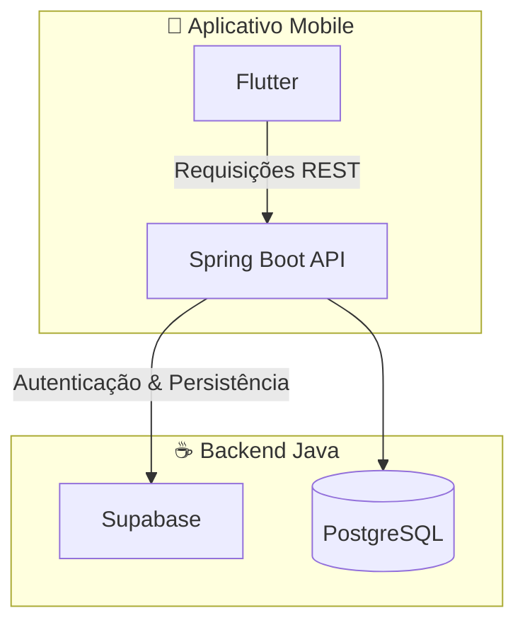

# 🛒 Ecommerce Lácteo  

Sistema de e-commerce voltado para produtos lácteos, composto por **aplicativo mobile (Flutter)** e **backend (Spring Boot + PostgreSQL/Supabase)**.  

---

## 📂 Estrutura do Repositório  

```bash
.
├── ecommerce-backend   # API em Java/Spring Boot
│   └── src/main/java/com
│       ├── config
│       ├── controller
│       ├── controllerAdvice
│       ├── domain
│       ├── dtos
│       ├── enums
│       ├── exceptions
│       ├── repositories
│       ├── responses
│       ├── security
│       └── services
│
├── ecommerce-mobile    # Aplicativo em Flutter
│   ├── android
│   ├── ios
│   ├── assets/icons
│   └── lib
│       ├── all
│       │   ├── components
│       │   ├── pages
│       │   ├── service
│       │   └── themes
│       └── client
│           ├── components
│           ├── models
│           ├── pages
│           └── service
│
├── .gitignore
└── README.md
```

---

## 🏗 Arquitetura do Sistema  



---

## 🚀 Tecnologias Utilizadas  

- **Frontend Mobile**: [Flutter](https://flutter.dev/)  
- **Backend**: [Java](https://www.java.com/) + [Spring Boot](https://spring.io/projects/spring-boot)  
- **Autenticação & Banco de Dados**: [Supabase](https://supabase.com/)  
- **Banco de Dados**: [PostgreSQL](https://www.postgresql.org/)  

---

## ⚙️ Como Executar  

### 📱 Mobile (Flutter)  

1. Acesse a pasta do app:  
   ```bash
   cd ecommerce-mobile
   flutter pub get
   flutter run
   ```  

2. O app será aberto no emulador ou dispositivo físico.  

---

### ☕ Backend (Spring Boot)  

1. Acesse a pasta do backend:  
   ```bash
   cd ecommerce-backend
   ```  

2. Configure o banco no arquivo `application.properties`:  
   ```properties
   spring.datasource.url=jdbc:postgresql://localhost:5432/seu_banco
   spring.datasource.username=usuario
   spring.datasource.password=senha
   spring.jpa.hibernate.ddl-auto=update
   ```  

3. Execute o projeto:  
   ```bash
   ./mvnw spring-boot:run
   ```  

---

## 📋 Funcionalidades (em desenvolvimento)  

- [ ] Autenticação de usuários  
- [ ] Listagem de produtos lácteos  
- [ ] Carrinho de compras  
- [ ] Integração entre app e backend  
- [ ] Persistência de dados no Supabase/PostgreSQL  

---

## 🖼 Prints do App  

> Coloque prints do app aqui para ilustrar.  
> Exemplo:  

<p align="center">
  
  
  
</p>  

---

## 🤝 Contribuindo  

1. Faça um fork do projeto  
2. Crie uma branch para sua feature (`git checkout -b minha-feature`)  
3. Commit suas mudanças (`git commit -m 'feat: minha nova feature'`)  
4. Push para a branch (`git push origin minha-feature`)  
5. Abra um Pull Request  

---

## 📄 Licença  

Este projeto está licenciado sob a licença **MIT** – veja o arquivo [LICENSE](LICENSE) para mais detalhes.  
